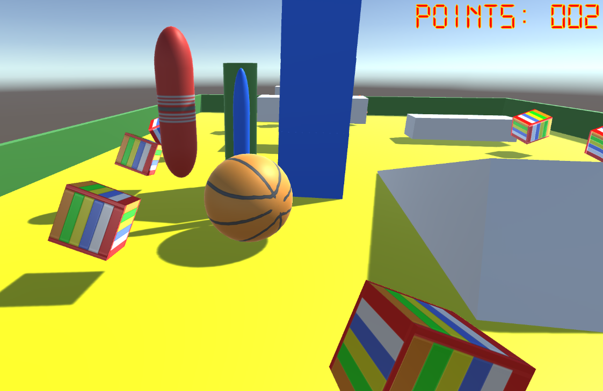
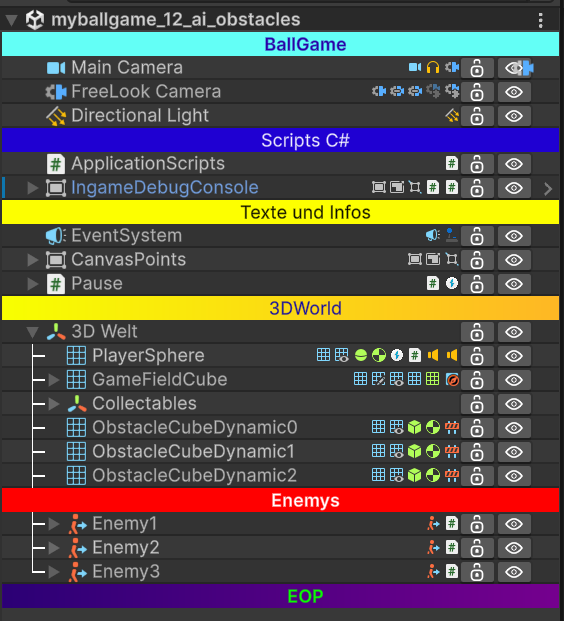

# Ball_Game
Lecture Material for Business Informatics, Graz, Austria
Lecture Ball Game Codes

Based on this Unity Tutorial: https://learn.unity.com/project/roll-a-ball 



## Part 1 (#4): Moving
* GamePad (InputSystem, PlayerInput)
* Player Controll
  * Jump (AddForce) 
  * Move (LateUpdate, left Thumpstick)
  * isGrounded (Collider, Tagging) 
* Animation (Platform)
* ProBuilder (Level Design) 


## Part 2: Collecting
* Menue (SceneManager) 
* Collection (Tags)
* Show Points (TMPro)
* Camera 
  * Cinemachine
  * Move in CamDirection (right Thumpstick)
  
## Part 3: Publishing
* Enemys, AI Navigation
  * Navigation NavMash
  * Obstacles
* Pause
* Scenen
* Publizieren, EXE

## Exkursion
* FLIP - CoSA Graz



## Tagging
```
[SerializeField] private UnityEvent myColliderEventEnter = null;
myColliderEventEnter.Invoke();
```
